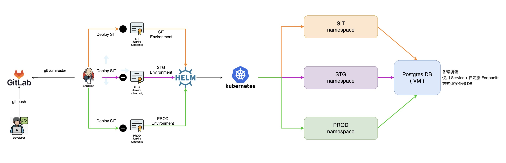
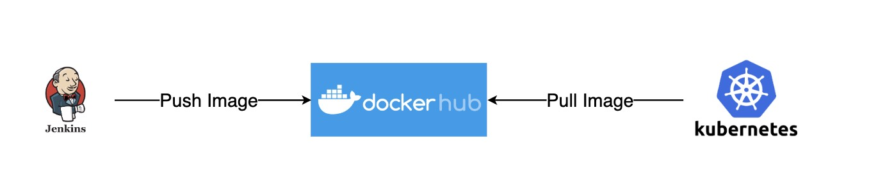
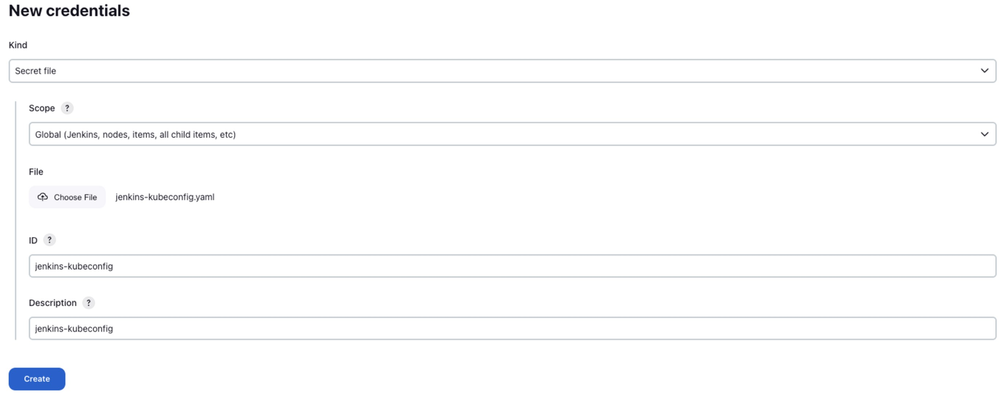

# 目錄
- [目錄](#目錄)
- [Introduction](#introduction)
- [Prerequisite](#prerequisite)
- [Architecture](#architecture)
- [Dockerizing Application](#dockerizing-application)
  - [Developer environment setup](#developer-environment-setup)
  - [Generate django project](#generate-django-project)
  - [Replace the Django application's configuration file with system environment variables.](#replace-the-django-applications-configuration-file-with-system-environment-variables)
- [Installation](#installation)
  - [PostgreSQL (For Ubuntu 20.04)](#postgresql-for-ubuntu-2004)
    - [Install](#install)
    - [Settings](#settings)
    - [Create Database User](#create-database-user)
    - [Grant Database Access](#grant-database-access)
  - [Helm 3](#helm-3)
    - [Install](#install-1)
    - [Plugins](#plugins)
      - [helm-secrets](#helm-secrets)
        - [introduction](#introduction-1)
        - [install](#install-2)
        - [Generate keypairs](#generate-keypairs)
        - [設定環境變數](#設定環境變數)
  - [Kubernetes RBAC](#kubernetes-rbac)
    - [建立 Private Key](#建立-private-key)
    - [建立 CSR](#建立-csr)
    - [申請 Kubernetes 證書](#申請-kubernetes-證書)
    - [建立 kubeconfig](#建立-kubeconfig)
    - [Jenkins 的 RBAC 授權](#jenkins-的-rbac-授權)
      - [建立 Namespace](#建立-namespace)
      - [建立 ClusterRole](#建立-clusterrole)
      - [建立 RoleBinding](#建立-rolebinding)
      - [測試權限](#測試權限)
      - [部署各環境的 kubeconfig 至 Jenkins 中](#部署各環境的-kubeconfig-至-jenkins-中)
- [Reference](#reference)


# Introduction
該專案目前用於自學如何使用 Jenkins pipeline 透過 Helm3 部署 Kubernetes Application ( still ongoing )


# Prerequisite
- Jenkins ( Use Jenkins pipeline )
- Makefile ( Utilitys for image build、push、deploy )
- PostgreSQL
- Helm 3
  - helm-secrets
- Kubernetes Cluster
  - Jenkins User
- Docker hub account
- Dockerizing Application


# Architecture



說明:
1. 開發人員 Push Code 至 Gitlab
2. 建立各環境 Jenkins Job (SIT / STG / PROD)
3. 各環境 Jenkins Job 會做以下幾件事
   - 依據 git commit tag 作為 container tag 並 push 至 docker hub 
   - 使用不同的 kubeconfig 並透過 Helm3 管理對應環境的 namespace
4. 因考慮到較少公司直接將 DB 使用Container , 故還是使用 VM , 透過自定義 EndPoints , 讓內部容器與DB連線


說明:
1. 依據 git commit tag 作為 container tag 並 push 至 docker hub 
2. 由 Helm3 管理 Kubernetes Cluster , 拉取指定的 commit tag


# Dockerizing Application

## Developer environment setup
```shell
pip install virtualenv
virtualenv venv
source venv/bin/activate
```

## Generate django project
```shell
pip install django
django-admin startproject app
```

## Replace the Django application's configuration file with system environment variables.
```python
# 引用以下這些Library
import os
import json
import logging

# 將以下配置項修改成讀取『環境變數』的方式
SECRET_KEY = os.getenv('DJANGO_SECRET_KEY')

DEBUG = os.getenv('DJANGO_DEBUG_MODE', False)

ALLOWED_HOSTS = os.getenv('DJANGO_ALLOWED_HOSTS', '127.0.0.1').split(',')

DATABASES = {
     'default': {
         'ENGINE': 'django.db.backends.{}'.format(os.getenv('DATABASE_ENGINE')),
         'NAME':     os.getenv('DATABASE_NAME'),
         'USER':     os.getenv('DATABASE_USERNAME'),
         'PASSWORD': os.getenv('DATABASE_PASSWORD'),
         'HOST':     os.getenv('DATABASE_HOST'),
         'PORT':     os.getenv('DATABASE_PORT'),
         'OPTIONS': json.loads(os.getenv('DATABASE_OPTIONS', '{}')),
     }
 }


# 新增以下配置
LOGLEVEL = os.getenv('DJANGO_LOGLEVEL', 'info').upper()

logging.config.dictConfig({
    'version': 1,
    'disable_existing_loggers': False,
    'formatters': {
        'console': {
            'format': '%(asctime)s %(levelname)s [%(name)s:%(lineno)s] %(module)s %(process)d %(thread)d %(message)s',
        },
    },
    'handlers': {
        'console': {
            'class': 'logging.StreamHandler',
            'formatter': 'console',
        },
    },
    'loggers': {
        '': {
            'level': LOGLEVEL,
            'handlers': ['console',],
        },
    },
})

```
因在Kubernetes中 , 我們也能夠將 `secret` 或者是 `configmap` 等方式注入到 Pod 內系統環境變數中 , 而 Django 也可以透過 `os.getenv()` 方法取得系統環境變數 , 透過這樣的方式取得實際配置 , 將配置內容與程式碼分離 , 相較於將DB資訊或 SECRET_KEY 等等機敏資訊直接儲存在 Code 裏面 , 還是透過這種分離的方式較為安全。


# Installation

## PostgreSQL (For Ubuntu 20.04)

### Install 
```shell
sudo apt update
sudo apt install postgresql postgresql-contrib
sudo systemctl enable postgresql.service --now
```

### Settings

```shell
# 修改主配置檔
vim /etc/postgresql/12/main/postgresql.conf

# 修改監聽IP , 預設為127.0.0.1 , 改為* , 機器上所有網卡都監聽
listen_addresses = '*'

# 修改連線白名單
vim /etc/postgresql/12/main/pg_hba.conf

# 在最後加入這段允許所有用戶在所有網段連接（安全上有問題,因為是Lab所以這樣設定, 不要再生產環境這樣做）
host    all             all             0.0.0.0/0               md5

# 重啟套用配置
sudo systemctl restart postgresql.service
```

### Create Database User

```shell

# 切換用戶名稱
root@postgresql:~# su - postgres

# 進入postgres命令行
postgres@postgresql:~$ psql

psql (12.14 (Ubuntu 12.14-0ubuntu0.20.04.1))
Type "help" for help.

-- 語法： CREATE USER myuser WITH PASSWORD 'secret_passwd';
-- 建立使用者帳號 , 將 帳號 myuser 及密碼 secret_passwd 替換成實際的用戶及密碼
postgres=# CREATE USER django_lab WITH PASSWORD 'django_lab';
CREATE ROLE

```

### Grant Database Access

```shell
root@postgresql:~# su - postgres

# 進入postgres命令行
postgres@postgresql:~$ psql

psql (12.14 (Ubuntu 12.14-0ubuntu0.20.04.1))
Type "help" for help.

-- 語法：CREATE DATABASE database_name;
-- 建立資料庫 , 將 database_name 替換成實際資料庫名稱
postgres=# CREATE DATABASE django_lab;
CREATE DATABASE

-- 語法：GRANT ALL PRIVILEGES ON DATABASE database_name TO username;
-- 授權指定使用者對指定Database擁有所有使用權 , 將 database_name 以及 username 替換成實際DB名稱以及用戶
postgres=# GRANT ALL PRIVILEGES ON DATABASE django_lab TO django_lab;
GRANT


```


## Helm 3

### Install
```shell
# 下載安裝腳本
$ curl -O https://raw.githubusercontent.com/helm/helm/master/scripts/get-helm-3

# 安裝
$ bash ./get-helm-3

# 驗證helm二進制文件可以執行 , 顯示對應版本
$ helm version
```

### Plugins

#### helm-secrets

##### introduction
在使用Helm 部署應用程序時，我們經常會遇到需要為所要部署的應用程序設定敏感信息值的情況，像是為應用程序自身設定登錄名稱或密碼訊息、設定應用程序連接資料庫所需資訊等等。

若將這些包含了敏感信息的值直接以明文的方式存儲在自定義的 Helm Values 文件中，當使用如 Git 等代碼版本控制工具追踪 Values 文件時，將會帶來非常大的安全隱患。

因此我們通常不會將這些敏感資訊保存在 Values 文件中 , 而是透過部署過程中，透過 Helm命令的 `--set` 參數 , 已命令行的方式設定變數值 

但使用這種方式同樣也有它自身的局限性：

- 首先，如果要設定的敏感字段過多，則在命令行中需要指定的參數就越多，這將使得命令行過於冗長且容易出錯，同時部署人員需要記住的部署參數也變得複雜起來；
- 其次，通過查看系統執行過的命令歷史記錄，同樣能夠獲取到在執行 HELM 命令時所有指定的敏感信息參數，這在一定程度上同樣存在安全隱患。

而本文將介紹另一種相對來說比較完美的解決方案：利用 Helm 的 secrets 插件，將這些包含了敏感信息的值通過某種加密手段加密之後，在保存到 Values 文件中去。

helm-secrets 插件可以幫助我們將定義在 values.yaml 文件中的值進行加密之後重新存儲到 Values 文件中，被加密後的 Values 文件可以被隨意分發、存儲到代碼版本管理工具中而不用擔心敏感信息被暴露。

##### install

在使用 helm-secrets 插件之前，首先確保該插件被安裝到了本地 HELM 中，安裝 HELM 插件非常簡單，使用下面命令直接進行安裝即可：

```shell
$ helm plugin install https://github.com/futuresimple/helm-secrets

# 如果系統是 arm64 Ubuntut , 則需要加入 dpkg --add-architecture arm64
```

```shell
$ helm plugin list
NAME       VERSION    DESCRIPTION
secrets    2.0.2      This plugin provides secrets values encryption for Helm charts secure storing
```

helm-secrets 插件是通過調用 SOPS 命令來對我們的 Values 文件進行加密和解密的，而 SOPS 本身又支持多種加密方式，如 AWS 雲的 KMS，Google 雲的 MKS，微軟 Azure 雲的 Key Vault，以及 PGP 等加密方式。

此處我們使用 `PGP` 加密方式 , 需要先安裝 `gnupg`

```bash
# Ubuntu，Debian 用户
$ sudo apt install gnupg

# CentOS，Fedora，RHEL 用户
$ sudo yum install gnupg

# MacOS 用户
$ brew install gnupg
```

GPG 同樣也使用了公鑰和私鑰的概念實現了非對稱加密算法。簡單來說：公鑰用於加密，擁有公鑰的人可以且僅僅可以進行加密操作，它可以分發給任何組織或個人；而私鑰則用於解密，且僅能用於解密那些由該私鑰與之配對的公鑰加密的信息，任何擁有私鑰的人都可以進行解密操作，因此，確保私鑰不被洩漏對安全性起著至關重要的作用。


##### Generate keypairs

在使用 gpg 命令進行加密解密之前，首先需要生成 GPG 公鑰和私鑰。

```shell
$ gpg --batch --generate-key << EOF
%echo Generating a basic OpenPGP key for HELM Secret
Key-Type: RSA
Key-Length: 4096
Subkey-Type: RSA
Subkey-Length: 4096
Name-Real: HELM Secret
Name-Comment: Used for HELM Secret Plugin
Name-Email: helm-secret@email.com
Expire-Date: 0
%no-ask-passphrase
%no-protection
%commit
%echo done
EOF

```
該命令將會為我們生成一對長度為 4096 且永不過期的 RSA 密鑰對，gpg 命令支持使用更多的參數來控制生成密鑰對，如為生成的密鑰對設定使用密碼等等，更多關於 GPG 命令的使用參數，請參考官方文檔。

當生成 GPG 密鑰對以後，我們就可通過 gpg 的 `--list-keys` 和 `--list-secret-keys` 命令分別列出當前系統中的公鑰和私鑰信息
在生成了密鑰對之後，就可以利用它們來為我們的文件進行加密和解密操作。


##### 設定環境變數

如果我們沒有在命令行通過 `--pgp`, `-p` 參數為 SOPS 指定密鑰信息，那麼它則會嘗試從 `SOPS_PGP_FP` 系統環境變量中獲取該信息，因此我們可以將密鑰對 ID 指定給該環境變數：
```shell
$ export SOPS_PGP_FP=00E0160999E3C663
```


## Kubernetes RBAC

### 建立 Private Key

```bash
# For SIT environment
$ openssl genrsa -out sit-jenkins.key 2048

# For STG environment
$ openssl genrsa -out stg-jenkins.key 2048

# For PROD environment
$ openssl genrsa -out prod-jenkins.key 2048
```

### 建立 CSR

```bash
# 建立每個環境 user 的 csr, (CN=<your env user name>)

# SIT 環境
$ openssl req -new -key sit-jenkins.key -out sit-jenkins.csr -subj "/CN=sit-jenkins"

# STG 環境
$ openssl req -new -key stg-jenkins.key -out stg-jenkins.csr -subj "/CN=stg-jenkins"

# PROD 環境
$ openssl req -new -key prod-jenkins.key -out prod-jenkins.csr -subj "/CN=prod-jenkins"
```

### 申請 Kubernetes 證書
這邊先用SIT環境作為範例 , 其餘STG以及PROD方法相同

```shell
# 先取得 CSR 的內容 , 而內容需要由base64進行encode , 且不能有斷行 , 所以要加上參數-w 0（CSR可以看作是證書申請文件)
$ cat sit-jenkins.csr | base64 -w 0 
LS0tLS1CRUdJTiBDRVJUSUZJQ0FURSBSRVFVRVNULS0tLS0KTUlJQ1Z6Q0NBVDhDQVFBd0VqRVFNQTRHQTFVRUF3d0hhbVZ1YTJsdWN6Q0NBU0l3RFFZSktvWklodmNOQVFFQgpCUUFEZ2dFUEFEQ0NBUW9DZ2dFQkFLNHpkSGF4N3d2VmlxalVxOG93MFB2ZDJuRVdTQlFFWVg3QSs0VFppVFRnCnJkMitST2VNdmU0U2xzWWNLQ0J5U2xHOVZNSjk5d0pVTTlKaVNjMVova0h0WE9zdWtlcWVTYUpuN1FhWDZPaHQKMCsvRERKaGFIMTFwcEFwL2x6S2hYSGRNbS82WkNEWG11R01KSm9NUk54ZmtVVGFaTEx6MzhEck5PWXdjb05wUQpwT1hVeWxZaWYyQy9mRWtCVm4rWFhBRS9zN3NPdXFOR1V0Rzk0ZTJLeUlxNzFTZWlVZE1mSGZYdmtIVmptU3NvClc3Rkp3ditVTEpkbW1lakhlYUN1eTNnSXNGRjR1QVBEUzhYcWhwOXNVUUhqWHl4MXhQQUdRUVlxUlc2NEYraTAKeFhLdzI5Nm1YbWpvcTgvK3ozemNPbzNnY3k0bTZUaGVTSEh1Y2h3NUlzTUNBd0VBQWFBQU1BMEdDU3FHU0liMwpEUUVCQ3dVQUE0SUJBUUI4eDdqc2FScnJlcjcwNEFEL1V4bmFGM3lhQ21MMEY3VUtxVWM2SHVGQTlNWW9FZjN4CjQrNU9iUmxCQVVnRGswbFQ5QlhMck9iQTBLaGFCZEZ2b3cvamFodTJPYTBqSnhXOEZQYVBEZ2JMWDYvTlZJcFMKQS9JTUsrWkNTNnp3TXdzZ0FVTGZPcG5NZm41VzVkMVZsSGRKV3RpZ0JOODJ5UlFPSzBXdTF1T0VzTmN5QUQybQpqVkdLTG45VkhqdE5RVmhub09SNmErQW55WHgySXFzQ21CcDkrN3RzSExDQ3NwV2xBOXRZblNVWGFyVDAydGNWCm02dkN2aE5BOVorOEFZTVgyRDNyUDVqSjJEcEFzSTk1SUxucmpES3JsVHY5bFFDakRGRDJodCswRVdXNXNqbjQKbk1yL0x0Zzg0amFJaEFlMUw4ZVBqcTliWHhjVms1U29zRk1RCi0tLS0tRU5EIENFUlRJRklDQVRFIFJFUVVFU1QtLS0tLQo=


# 建立 k8s 證書申請(CertificateSigningRequest)的 yaml file (依序將每個使用者的CSR建立)
$ cat << EOF > sit-jenkins-user-csr.yaml
apiVersion: certificates.k8s.io/v1
kind: CertificateSigningRequest
metadata:
  name: sit-jenkins-user
spec:
  groups:
    - system:authenticated
  request: LS0tLS1CRUdJTiBDRVJUSUZJQ0FURSBSRVFVRVNULS0tLS0KTUlJQ1Z6Q0NBVDhDQVFBd0VqRVFNQTRHQTFVRUF3d0hhbVZ1YTJsdWN6Q0NBU0l3RFFZSktvWklodmNOQVFFQgpCUUFEZ2dFUEFEQ0NBUW9DZ2dFQkFLNHpkSGF4N3d2VmlxalVxOG93MFB2ZDJuRVdTQlFFWVg3QSs0VFppVFRnCnJkMitST2VNdmU0U2xzWWNLQ0J5U2xHOVZNSjk5d0pVTTlKaVNjMVova0h0WE9zdWtlcWVTYUpuN1FhWDZPaHQKMCsvRERKaGFIMTFwcEFwL2x6S2hYSGRNbS82WkNEWG11R01KSm9NUk54ZmtVVGFaTEx6MzhEck5PWXdjb05wUQpwT1hVeWxZaWYyQy9mRWtCVm4rWFhBRS9zN3NPdXFOR1V0Rzk0ZTJLeUlxNzFTZWlVZE1mSGZYdmtIVmptU3NvClc3Rkp3ditVTEpkbW1lakhlYUN1eTNnSXNGRjR1QVBEUzhYcWhwOXNVUUhqWHl4MXhQQUdRUVlxUlc2NEYraTAKeFhLdzI5Nm1YbWpvcTgvK3ozemNPbzNnY3k0bTZUaGVTSEh1Y2h3NUlzTUNBd0VBQWFBQU1BMEdDU3FHU0liMwpEUUVCQ3dVQUE0SUJBUUI4eDdqc2FScnJlcjcwNEFEL1V4bmFGM3lhQ21MMEY3VUtxVWM2SHVGQTlNWW9FZjN4CjQrNU9iUmxCQVVnRGswbFQ5QlhMck9iQTBLaGFCZEZ2b3cvamFodTJPYTBqSnhXOEZQYVBEZ2JMWDYvTlZJcFMKQS9JTUsrWkNTNnp3TXdzZ0FVTGZPcG5NZm41VzVkMVZsSGRKV3RpZ0JOODJ5UlFPSzBXdTF1T0VzTmN5QUQybQpqVkdLTG45VkhqdE5RVmhub09SNmErQW55WHgySXFzQ21CcDkrN3RzSExDQ3NwV2xBOXRZblNVWGFyVDAydGNWCm02dkN2aE5BOVorOEFZTVgyRDNyUDVqSjJEcEFzSTk1SUxucmpES3JsVHY5bFFDakRGRDJodCswRVdXNXNqbjQKbk1yL0x0Zzg0amFJaEFlMUw4ZVBqcTliWHhjVms1U29zRk1RCi0tLS0tRU5EIENFUlRJRklDQVRFIFJFUVVFU1QtLS0tLQo=
  signerName: kubernetes.io/kube-apiserver-client
  expirationSeconds: 315569260
  usages:
    - digital signature
    - key encipherment
    - client auth
EOF
# 備注: usages說明
# TLS客戶端證書的請求通行要求："digital signature" / "key encipherment" / "client auth"
# TLS 服務證書的請求通常要求："key encipherment" / "digital signature" / "server auth"

# 套用
$ kubectl create -f sit-jenkins-user-csr.yaml

# 查看CSR列表
$ kubectl get csr

# Approve 申請
$ kubectl certificate approve sit-jenkins-user

# 取得實際Client整書內容
$ kubectl get csr sit-jenkins-user -o jsonpath='{.status.certificate}' | base64 -d > sit-jenkins.crt

```

### 建立 kubeconfig

這邊先用SIT環境作為範例 , 其餘STG以及PROD方法相同

```shell
$ kubectl config --kubeconfig=sit-jenkins-kubeconfig.yml set-cluster kubernetes --server https://10.211.55.11:6443 --insecure-skip-tls-verify
$ kubectl config --kubeconfig=sit-jenkins-kubeconfig.yml set-credentials sit-jenkins --client-certificate=sit-jenkins.crt --client-key=sit-jenkins.key --embed-certs=true
$ kubectl config --kubeconfig=sit-jenkins-kubeconfig.yml set-context default --cluster=kubernetes --user=sit-jenkins --namespace sit
$ kubectl config --kubeconfig=sit-jenkins-kubeconfig.yml use-context default

# 此時因為還沒建立jenkins用戶的RBAC , 所以會出現沒有相關權限
$ kubectl get pods -n devops --kubeconfig jenkins-kubeconfig.yml
Error from server (Forbidden): pods is forbidden: User "jenkins" cannot list resource "pods" in API group "" in the namespace "devops"

```

###  Jenkins 的 RBAC 授權

ClusterRole

因每個環境的 Jenkins帳號的權限應當相同 , 故使用 ClusterRole Resource , 就不需要每個環境再新建立一個 Role , 只需要共用同一個 Role

| ClusterRole | Resource | Verb | apiGroups |
| --- | --- | --- | --- |
| jenkins-deploy | * | * | "" |
|  | * | * | apps |


RoleBinding

| User | ClusterRole | Namespace |
| --- | --- | --- |
| sit-jenkins | jenkins-deploy | sit |
| stg-jenkins | jenkins-deploy | stg |
| prod-jenkins | jenkins-deploy | prod |


#### 建立 Namespace

```shell
kubectl create namespace sit
kubectl create namespace stg
kubectl create namespace prod
```

#### 建立 ClusterRole
```shell
cat > jenkins_deploy_cluster_role.yaml << EOF
---
apiVersion: rbac.authorization.k8s.io/v1
kind: ClusterRole
metadata:
  name: jenkins_deploy_cluster_role
rules:
  - apiGroups: [""]
    resources: ["*"]
    verbs: ["*"]
  - apiGroups: ["apps"]
    resources: ["*"]
    verbs: ["*"]
EOF
```

#### 建立 RoleBinding

SIT
```shell
cat > sit_jenkins_deploy_rolebinding.yaml << EOF
---
apiVersion: rbac.authorization.k8s.io/v1
kind: RoleBinding
metadata:
  name: jenkins_deploy_role_binding
  namespace: sit
subjects:
- kind: User
  name: sit-jenkins
  apiGroup: rbac.authorization.k8s.io
roleRef:
  apiGroup: rbac.authorization.k8s.io
  kind: ClusterRole
  name: jenkins_deploy_cluster_role
EOF
```

STG
```shell
cat > stg_jenkins_deploy_rolebinding.yaml << EOF
---
apiVersion: rbac.authorization.k8s.io/v1
kind: RoleBinding
metadata:
  name: jenkins_deploy_role_binding
  namespace: stg
subjects:
- kind: User
  name: stg-jenkins
  apiGroup: rbac.authorization.k8s.io
roleRef:
  apiGroup: rbac.authorization.k8s.io
  kind: ClusterRole
  name: jenkins_deploy_cluster_role
EOF
```

PROD
```shell
cat > prod_jenkins_deploy_rolebinding.yaml << EOF
---
apiVersion: rbac.authorization.k8s.io/v1
kind: RoleBinding
metadata:
  name: jenkins_deploy_role_binding
  namespace: prod
subjects:
- kind: User
  name: prod-jenkins
  apiGroup: rbac.authorization.k8s.io
roleRef:
  apiGroup: rbac.authorization.k8s.io
  kind: ClusterRole
  name: jenkins_deploy_cluster_role
EOF
```


#### 測試權限

```shell
# 有兩種方法可以測試權限 ,
# 1. 一種是用 kubectl auth can-i 方式測試 
# 2. 另一種是用剛剛產生的 kubeconfig 進行測試


$ kubectl auth can-i get pods -n sit --as sit-jenkins
yes

$ kubectl get pods -n sit --kubeconfig sit-jenkins-kubeconfig.yml
No resources found in devops namespace.
```

#### 部署各環境的 kubeconfig 至 Jenkins 中



在 Jenkins 中加入 Crediential , 種類選擇 Secret file , 實際檔案就是我們產生的 jenkins-kubeconfig.yaml , id & desciption 可以加上環境以便區分。


# Reference

https://segmentfault.com/a/1190000040199249