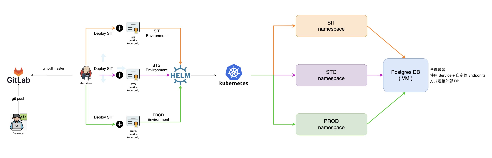
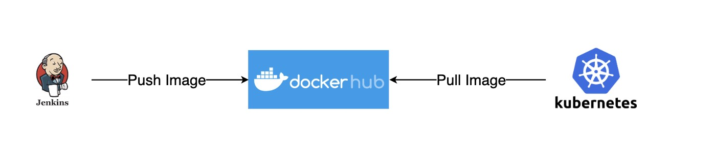

目錄
- [Introduction](#introduction)
- [Architecture](#architecture)
- [Prerequisite](#prerequisite)
- [Installation](#installation)
  - [PostgreSQL (For Ubuntu 20.04)](#postgresql-for-ubuntu-2004)
    - [Install](#install)
    - [Settings](#settings)
    - [Create Database User](#create-database-user)
    - [Grant Database Access](#grant-database-access)


# Introduction
該專案目前用於自學如何使用 Jenkins pipeline 透過 Helm3 部署 Kubernetes Application


# Architecture



說明:
1. 開發人員 Push Code 至 Gitlab
2. 建立各環境 Jenkins Job (SIT / STG / PROD)
3. 各環境 Jenkins Job 會做以下幾件事
   - 依據 git commit tag 作為 container tag 並 push 至 docker hub 
   - 使用不同的 kubeconfig 並透過 Helm3 管理對應環境的 namespace
4. 因考慮到較少公司直接將 DB 使用Container , 故還是使用 VM , 透過自定義 EndPoints , 讓內部容器與DB連線


說明:
1. 依據 git commit tag 作為 container tag 並 push 至 docker hub 
2. 由 Helm3 管理 Kubernetes Cluster , 拉取指定的 commit tag


# Prerequisite
- Jenkins ( Use Jenkins pipeline )
- PostgreSQL
- Helm 3
- Kubernetes Cluster
- Docker hub account


# Installation

## PostgreSQL (For Ubuntu 20.04)

### Install 
```shell
sudo apt update
sudo apt install postgresql postgresql-contrib
sudo systemctl enable postgresql.service --now
```

### Settings

```shell
# 修改主配置檔
vim /etc/postgresql/12/main/postgresql.conf

# 修改監聽IP , 預設為127.0.0.1 , 改為* , 機器上所有網卡都監聽
listen_addresses = '*'

# 修改連線白名單
vim /etc/postgresql/12/main/pg_hba.conf

# 在最後加入這段允許所有用戶在所有網段連接（安全上有問題,因為是Lab所以這樣設定, 不要再生產環境這樣做）
host    all             all             0.0.0.0/0               md5

# 重啟套用配置
sudo systemctl restart postgresql.service
```

### Create Database User

```shell

# 切換用戶名稱
root@postgresql:~# su - postgres

# 進入postgres命令行
postgres@postgresql:~$ psql

psql (12.14 (Ubuntu 12.14-0ubuntu0.20.04.1))
Type "help" for help.

-- 語法： CREATE USER myuser WITH PASSWORD 'secret_passwd';
-- 建立使用者帳號 , 將 帳號 myuser 及密碼 secret_passwd 替換成實際的用戶及密碼
postgres=# CREATE USER django_lab WITH PASSWORD 'django_lab';
CREATE ROLE

```

### Grant Database Access

```shell
root@postgresql:~# su - postgres

# 進入postgres命令行
postgres@postgresql:~$ psql

psql (12.14 (Ubuntu 12.14-0ubuntu0.20.04.1))
Type "help" for help.

-- 語法：CREATE DATABASE database_name;
-- 建立資料庫 , 將 database_name 替換成實際資料庫名稱
postgres=# CREATE DATABASE django_lab;
CREATE DATABASE

-- 語法：GRANT ALL PRIVILEGES ON DATABASE database_name TO username;
-- 授權指定使用者對指定Database擁有所有使用權 , 將 database_name 以及 username 替換成實際DB名稱以及用戶
postgres=# GRANT ALL PRIVILEGES ON DATABASE django_lab TO django_lab;
GRANT


```